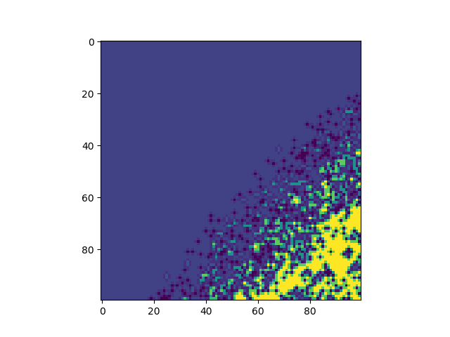

# Investigating local predictability and shifts in behavioural strategy

This repository is the source for a project that uses simulation data output to examine whether transitions in behavioural strategy are related to landscape heterogeneity.

## Attribution

Please contact the following before cloning or in case of interest in the project.

Pratik Gupte (author and maintainer)  
[PhD student, GELIFES -- University of Groningen](https://www.rug.nl/staff/p.r.gupte)  
p.r.gupte@rug.nl  
Nijenborgh 7/5172.0583 9747AG Groningen
